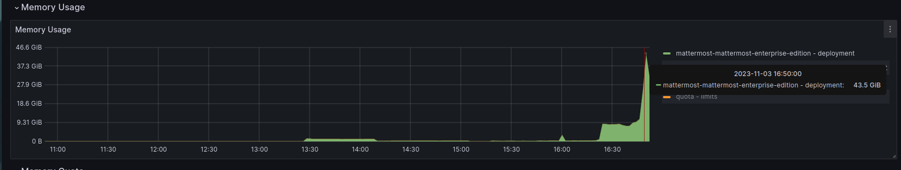
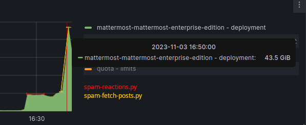
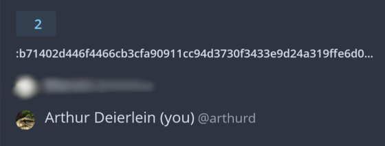

# CVE-2024-1402

| Weakness Enumeration |
| -------------------- |
| CWE-400              |

## Impact

DoS achieved through OOM-kill

### Side Effect

A side effect of spamming reactions is that it might crash the mobile app of a user seeing the post.

## Exploitation

### Spamming Reactions

First we spam send reactions of the maximum length. Important to note is that the reactions do not have to exist.

[spam-reactions.py](./scripts/spam-reactions.py) is an example of how this could be achieved.

Mobile still renders these reactions:

This can crash the mobile app of users seeing the post.

Instances with few resources (e.g. 1GiB RAM) can also be taken down just with this.
The Web app might become a lot slower to use during exploitation. Instances might get taken down because a user requests the posts we spammed with reactions.

### Fetching posts with thousands of reactions

As a second step we now spam request the posts that have thousands of reactions.

[spam-fetch-posts.py](./scripts/spam-fetch-posts.py) is an example of how this could be achieved.

The API quickly becomes unusable (about 10seconds), requests don't return anything, and the RAM usage increases rapidly, see metrics:

